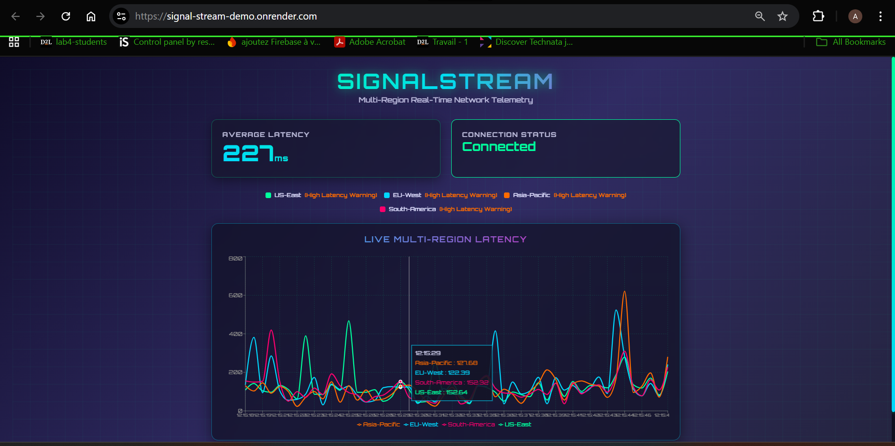
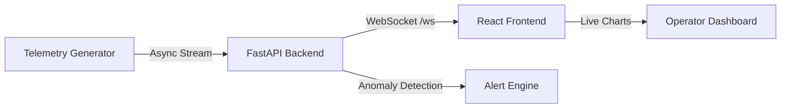

<div align="center">

# 📡 SignalStream

<h1>
  <a href="https://signal-stream-demo.onrender.com" target="_blank">
    🔗 LIVE DEMO 🚀
  </a>
</h1>

<p>
  <strong>Click above for real-time multi-region network telemetry streaming!</strong>
</p>

<p>
  
  
  
  
  
  
</p>

<br>



<br>

</div>

## 🚀 Highlights

* 🔄 Real-time telemetry streaming via **WebSockets**
* 📊 Live latency visualization with **React + Recharts**
* 🚨 Automatic anomaly detection (latency > 200 ms)
* ⚡ Asynchronous backend with **FastAPI + AsyncIO**
* ☁️ Cloud-ready architecture (AWS EC2)

---

## 🛠 Tech Stack

**Backend**

* Python 3.10
* FastAPI (ASGI)
* Uvicorn
* AsyncIO

**Frontend**

* React 18 (Vite)
* Recharts

**Infrastructure**

* AWS EC2 (Ubuntu)
* WebSockets

---

## 🧱 System Architecture



**Flow Overview:**

1. The backend asynchronously generates telemetry data.
2. Data is streamed to the frontend via a persistent WebSocket connection.
3. The React dashboard renders live charts every 500 ms.
4. Latency spikes above 200 ms trigger real-time alerts.

---

## ⚙️ Local Setup (Detailed but Recruiter-Friendly)

The project runs as **two separate services** that communicate over WebSockets:

* a **FastAPI backend** (data generation + streaming)
* a **React frontend** (live visualization)

Both services must be running simultaneously for the dashboard to function correctly.

---

### 1️⃣ Clone the Repository

```bash
git clone https://github.com/MelvynAv/signal-stream.git
cd signal-stream
```
---

### 2️⃣ Backend Setup (FastAPI + WebSockets)

The backend is responsible for:

* generating synthetic latency telemetry
* detecting anomalies asynchronously
* streaming data to connected clients via WebSockets

#### Navigate to the backend directory

```bash
cd backend
```

#### Create and activate a virtual environment

**Windows**

```bash
python -m venv .venv
.\.venv\Scripts\activate
```

**macOS / Linux**

```bash
python3 -m venv .venv
source .venv/bin/activate
```

#### Install backend dependencies

```bash
pip install -r requirements.txt
```

#### Start the backend server

```bash
python main.py
```

If successful, you should see output similar to:

```
INFO:     Uvicorn running on http://127.0.0.1:5000
```

The backend exposes a WebSocket endpoint at:

```
ws://127.0.0.1:5000/ws
```

Leave this terminal running.

---

### 3️⃣ Frontend Setup (React + Live Charts)

The frontend:

* establishes a persistent WebSocket connection
* receives telemetry updates every 500 ms
* renders real-time charts and alerts

#### Open a new terminal and navigate to the frontend

```bash
cd frontend
```

#### Install frontend dependencies

```bash
npm install
```

#### Start the development server

```bash
npm run dev
```

Vite will output a local URL, typically:

```
http://localhost:5173
```

---

### 4️⃣ Verify the Application

Open your browser and navigate to:

```
http://localhost:5173
```

You should observe:

* **Network Status: Active** indicator
* live latency values updating in real time
* visual alerts when latency exceeds 200 ms

If the dashboard is live, the WebSocket pipeline is working end-to-end.

---

## 🎯 What This Project Demonstrates

* Real-time system design (push-based data flow)
* WebSocket communication and async backends
* Frontend performance considerations for live data
* Practical cloud deployment foundations

---

## 📄 License

MIT License
